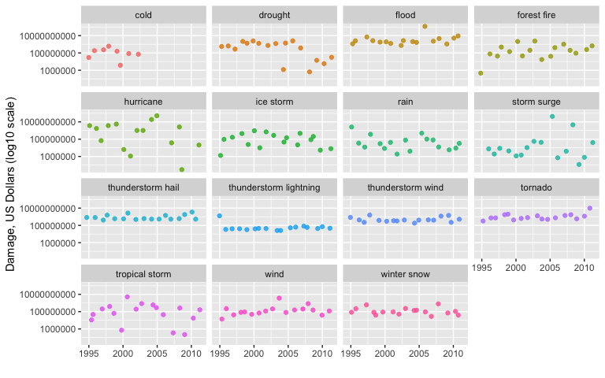
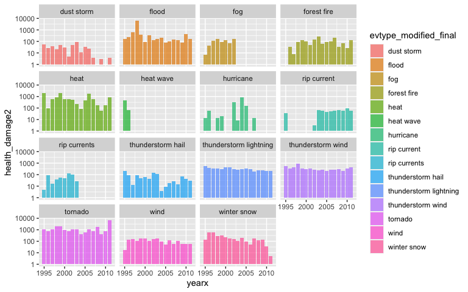

# Synopsis

Need to create the synopsis.

## US Storm data -- Analysis using R

#### Acronym used in this document

* NCDC -- National Climatic Data Center
* NWS -- National Weather Service

#### Where does the data come from?
NCDC receives Storm Data from the National Weather Service. The National Weather service receive their information from a variety of sources, which include but are not limited to: county, state an federal emergency management officials, local law enforcement officials, skywarn spotters, NW damage surveys, newspaper clipping services, the insurance industry and the general public.


#### How are the damage amounts determined?
The National Weather Service makes a best guess using all available data at the time of the publication The damage amounts are received from a variety of sources, including those listed above in the Dat Sources section. Property and Crop damage should be considered as a broad estimate.

The purpose of this analysis is to assemble the analysis data, and report on key features observed.

# Data Processing

### Required R Packages, processing system details 

The `tidyverse` package will suit this analysis (dplyr and ggplot2 specifically).  Note that `lubridate` is also called, although it is not used much in this code.  

This analysis work was developed on the following system:

      Model Name: iMac
      Processor Name: Quad-Core Intel Core i7
      Memory: 32 GB


```r
library(tidyverse)
```

```
── Attaching packages ───────────────────────────────────────────────────────────────────────────────────────────────────────────────────────────────────────── tidyverse 1.3.0 ──
```

```
✓ ggplot2 3.3.2     ✓ purrr   0.3.4
✓ tibble  3.0.3     ✓ dplyr   1.0.1
✓ tidyr   1.1.1     ✓ stringr 1.4.0
✓ readr   1.3.1     ✓ forcats 0.5.0
```

```
── Conflicts ──────────────────────────────────────────────────────────────────────────────────────────────────────────────────────────────────────────── tidyverse_conflicts() ──
x dplyr::filter() masks stats::filter()
x dplyr::lag()    masks stats::lag()
```

```r
library(lubridate)
```

```

Attaching package: 'lubridate'
```

```
The following objects are masked from 'package:base':

    date, intersect, setdiff, union
```

### **raw_us_storms** creation

#### Raw file naming details

Here are the names used in this work.  While the **.csv** inside the **.bz2** file can be read easily by R, it was decided a view of the raw, uncompressed data was of value for research purposes.  If an update occurs, or a new set of data (with the same layout) are available, one simply updates these settings.

Checks are performed to avoid repeated download/uncompress tasks on the raw file.

1. assign raw file names
2. download the file if necessary
3. uncompress .bz2 file if necessary


```r
raw_link <- "https://d396qusza40orc.cloudfront.net/repdata%2Fdata%2FStormData.csv.bz2"
raw_zip_file_name <- "StormData.csv.bz2"
raw_file_name <- "StormData.csv"

ifelse(file.exists(raw_zip_file_name) == FALSE,
       download.file(raw_link, raw_zip_file_name),
       "file exists...you are good to go")
```

```
[1] "file exists...you are good to go"
```

```r
ifelse(file.exists(raw_file_name) == FALSE,
       bunzip2(raw_zip_file_name),
       "StormData.csv exists")
```

```
[1] "StormData.csv exists"
```

#### Read the data

An examination of the raw data (e.g., UltraEdit, Notepad++) reveals:

* upper case variable names in a header record
* mixed case for much of the data, although most are upper case for EVTYPE (weather event type)
* seems chronologically ordered (1950s through 2010s)
* very large free text values for REMARKS variable, these appear at the end (i.e., more recent have remarks)

The code below reads in the raw data, modifies the upper case names to lower case.  There is a REFNUM (now refnum) which appears to be an incremental key defining the weather events impacts.  A check is performed to test the consistency of refnum, it does indeed hold true that it is just a counter.


```r
raw_names <- read.csv(raw_file_name, header=TRUE, nrows = 1)
raw_us_storms <- read.csv(raw_file_name, stringsAsFactors = FALSE)
head(raw_us_storms)
```

```
  STATE__           BGN_DATE BGN_TIME TIME_ZONE COUNTY COUNTYNAME STATE  EVTYPE
1       1  4/18/1950 0:00:00     0130       CST     97     MOBILE    AL TORNADO
2       1  4/18/1950 0:00:00     0145       CST      3    BALDWIN    AL TORNADO
3       1  2/20/1951 0:00:00     1600       CST     57    FAYETTE    AL TORNADO
4       1   6/8/1951 0:00:00     0900       CST     89    MADISON    AL TORNADO
5       1 11/15/1951 0:00:00     1500       CST     43    CULLMAN    AL TORNADO
6       1 11/15/1951 0:00:00     2000       CST     77 LAUDERDALE    AL TORNADO
  BGN_RANGE BGN_AZI BGN_LOCATI END_DATE END_TIME COUNTY_END COUNTYENDN
1         0                                               0         NA
2         0                                               0         NA
3         0                                               0         NA
4         0                                               0         NA
5         0                                               0         NA
6         0                                               0         NA
  END_RANGE END_AZI END_LOCATI LENGTH WIDTH F MAG FATALITIES INJURIES PROPDMG
1         0                      14.0   100 3   0          0       15    25.0
2         0                       2.0   150 2   0          0        0     2.5
3         0                       0.1   123 2   0          0        2    25.0
4         0                       0.0   100 2   0          0        2     2.5
5         0                       0.0   150 2   0          0        2     2.5
6         0                       1.5   177 2   0          0        6     2.5
  PROPDMGEXP CROPDMG CROPDMGEXP WFO STATEOFFIC ZONENAMES LATITUDE LONGITUDE
1          K       0                                         3040      8812
2          K       0                                         3042      8755
3          K       0                                         3340      8742
4          K       0                                         3458      8626
5          K       0                                         3412      8642
6          K       0                                         3450      8748
  LATITUDE_E LONGITUDE_ REMARKS REFNUM
1       3051       8806              1
2          0          0              2
3          0          0              3
4          0          0              4
5          0          0              5
6          0          0              6
```

```r
names(raw_us_storms) <- tolower(names(raw_names))
str(raw_us_storms)
```

```
'data.frame':	902297 obs. of  37 variables:
 $ state__   : num  1 1 1 1 1 1 1 1 1 1 ...
 $ bgn_date  : chr  "4/18/1950 0:00:00" "4/18/1950 0:00:00" "2/20/1951 0:00:00" "6/8/1951 0:00:00" ...
 $ bgn_time  : chr  "0130" "0145" "1600" "0900" ...
 $ time_zone : chr  "CST" "CST" "CST" "CST" ...
 $ county    : num  97 3 57 89 43 77 9 123 125 57 ...
 $ countyname: chr  "MOBILE" "BALDWIN" "FAYETTE" "MADISON" ...
 $ state     : chr  "AL" "AL" "AL" "AL" ...
 $ evtype    : chr  "TORNADO" "TORNADO" "TORNADO" "TORNADO" ...
 $ bgn_range : num  0 0 0 0 0 0 0 0 0 0 ...
 $ bgn_azi   : chr  "" "" "" "" ...
 $ bgn_locati: chr  "" "" "" "" ...
 $ end_date  : chr  "" "" "" "" ...
 $ end_time  : chr  "" "" "" "" ...
 $ county_end: num  0 0 0 0 0 0 0 0 0 0 ...
 $ countyendn: logi  NA NA NA NA NA NA ...
 $ end_range : num  0 0 0 0 0 0 0 0 0 0 ...
 $ end_azi   : chr  "" "" "" "" ...
 $ end_locati: chr  "" "" "" "" ...
 $ length    : num  14 2 0.1 0 0 1.5 1.5 0 3.3 2.3 ...
 $ width     : num  100 150 123 100 150 177 33 33 100 100 ...
 $ f         : int  3 2 2 2 2 2 2 1 3 3 ...
 $ mag       : num  0 0 0 0 0 0 0 0 0 0 ...
 $ fatalities: num  0 0 0 0 0 0 0 0 1 0 ...
 $ injuries  : num  15 0 2 2 2 6 1 0 14 0 ...
 $ propdmg   : num  25 2.5 25 2.5 2.5 2.5 2.5 2.5 25 25 ...
 $ propdmgexp: chr  "K" "K" "K" "K" ...
 $ cropdmg   : num  0 0 0 0 0 0 0 0 0 0 ...
 $ cropdmgexp: chr  "" "" "" "" ...
 $ wfo       : chr  "" "" "" "" ...
 $ stateoffic: chr  "" "" "" "" ...
 $ zonenames : chr  "" "" "" "" ...
 $ latitude  : num  3040 3042 3340 3458 3412 ...
 $ longitude : num  8812 8755 8742 8626 8642 ...
 $ latitude_e: num  3051 0 0 0 0 ...
 $ longitude_: num  8806 0 0 0 0 ...
 $ remarks   : chr  "" "" "" "" ...
 $ refnum    : num  1 2 3 4 5 6 7 8 9 10 ...
```

#### Raw data facts

The table below displays some key data about the raw file.  Two item are particularly noteworthy, the distinct event types (n=985) and the property damage "exp" (expansion?) variable, propdmgexp.

As mentioned above, human observers are inputting these data, and as such there are a large number of weather evtype values.  While a complicated subject, weather in the United States could be described in more broad terms, with fewer evtype values.  Later in this analysis code will flag and re-define evtype to this end.  

For a real example, if "hail" is a high damage weather event, but is defined in the data both as "HAIL", "HAIL 175" and "EXTREME HAIL" depending on the observer, a more accurate damage calculation occurs with all three hail evtype values summed together.  

The second noteworthy item is the propdmgexp variable.  Below is taken from the page 12 of the documentation...

	"Estimates should be rounded to three significant digits, followed by an alphabetical character signifying the magnitude of the number, i.e., 1.55B for $1,550,000,000. Alphabetical characters used to signify magnitude include “K” for thousands, “M” for millions, and “B” for billions."

Therefore the propdmg (and similarly cropdmg -- crop damage) value will be *expanded* accordingly.  The reader will see this in code below.

In summary, three variables will be modified, the propdmg/cropdmg variables expanded, and the evtype values collapsed.  Note the expansion required for economic damage is due to very large numbers, and these are not observed in the injuries/fatalities variables.

The below fact table displays data from the raw_us_storms data...


Table: **raw_us_storms fact table**

|                                       |value             |
|:--------------------------------------|:-----------------|
|**record count, raw file**             |902297            |
|**distinct refnum values**             |902297            |
|**distinct evtype values**             |985               |
|**distinct evtype values, damage > 0** |488               |
|**example bgn_date value**             |1/13/1972 0:00:00 |
|**example evtype value**               |TORNADO           |
|**example propdmg value**              |250               |
|**example propdmgexp value**           |K                 |
|**example injuries value**             |2                 |

#### Checking the refnum variable

It is important to confirm the consistency of the refnum variable.  For example, when a storm event affects multiple locations, are the same refnum values used?

Below indicates this is a unique identifier, at the storm event level (time, place, type).


```r
nrow(raw_us_storms)
```

```
[1] 902297
```

```r
new_refnum <- as.data.frame(seq(1:nrow(raw_us_storms)))
names(new_refnum) <- "new_refnum"
head(new_refnum)
```

```
  new_refnum
1          1
2          2
3          3
4          4
5          5
6          6
```

```r
check_refnum <- raw_us_storms %>% select(refnum) %>% inner_join(new_refnum, by = c("refnum"="new_refnum"))
head(check_refnum)
```

```
  refnum
1      1
2      2
3      3
4      4
5      5
6      6
```

```r
nrow(raw_us_storms) == nrow(check_refnum)
```

```
[1] TRUE
```

#### **sample_us_storms** creation, sampling the data for development

Due to a large amount of data (nearly 1mm records), a random sample is drawn to develop the analysis data.  The seed is set below to ensure reproducibility.  A sample of refnum values will be used to extract and work on the data.

Note that the full analysis can be easily run by setting the sample_size value to 1 (one).  In the end, the analysis will look at *total* damages and not averages, it will be important for the final run to set to full blown (sample_size 1).


```r
set.seed(1234)
#sample_size <- .1
sample_size <- 1
sample_refnum_list <- as.data.frame(sample(raw_us_storms$refnum, sample_size * nrow(raw_us_storms)))
names(sample_refnum_list) <- "refnum"
head(sample_refnum_list)
```

```
  refnum
1 761680
2 630608
3 304108
4 295826
5 126055
6 382504
```

As the data cover the entire United States, for convenience the US "region" is obtained from R's built-in US state/region data frames.  This aids in determining the consistency within the state variable, as well as allowing for regional analysis (small number as opposed to all 50 states).  (*Note regional analyses are not included in this report*)


```r
state_df <- data.frame(state.abb, state.region)
names(state_df) <- c("state", "region")
head(state_df)
```

```
  state region
1    AL  South
2    AK   West
3    AZ   West
4    AR  South
5    CA   West
6    CO   West
```

Below is code that will take the raw data and...

1. sample down the data (when sample_size not 1)
2. merge on by state the US region
3. filter to keep only weather events that resulted in damage
4. make real dates the character versions in raw
5. filter older data out using a year cutoff value
6. reduce the number of variables
7. store the untouched version of evtype in evtype_original -- evtype is trimmed and set to lower case
8. expand variables per above

The results are shown below.  One more **important** bit of logic, the economic_damage and health_damage variables are created.  Economic damage is the sum of property damage and crop damage (after expansion).  The health damage will be measured by the sum of the fatalities and injuries.


```r
yearx_cutoff <- 1995

sample_us_storms <- inner_join(raw_us_storms, sample_refnum_list, by = "refnum") %>%
	filter(propdmg > 0 | cropdmg > 0 | fatalities > 0 | injuries > 0) %>%
	left_join(state_df, by = "state") %>%
	mutate(bgn_datex=mdy_hms(bgn_date),
	       end_datex=mdy_hms(end_date),
	       yearx=year(bgn_datex),
	       monthx=month(bgn_datex),
	       storm_seconds=end_datex-bgn_datex,
	       storm_days=as.duration(storm_seconds)) %>% 
	filter(yearx >= yearx_cutoff) %>%
	select(refnum, region, state__:evtype, end_date, 
	       bgn_datex, end_datex, yearx, monthx, storm_seconds, storm_days,
	       fatalities, injuries,
	       propdmg, propdmgexp,
	       cropdmg, cropdmgexp) %>%
	mutate(evtype_original = evtype) %>%
	mutate(evtype=str_trim(tolower(evtype), side = "both")) %>%
	mutate(newpropdmg=ifelse(toupper(propdmgexp)=="K",
				 propdmg*1000,ifelse(toupper(propdmgexp)=="M",
				 		    propdmg*1000000, ifelse(toupper(propdmgexp)=="B",
				 		    			propdmg*1000000000,propdmg)))) %>%
	mutate(newcropdmg=ifelse(toupper(cropdmgexp)=="K",
				 cropdmg*1000,ifelse(toupper(cropdmgexp)=="M",
				 		    cropdmg*1000000, ifelse(toupper(cropdmgexp)=="B",
				 		    			cropdmg*1000000000,cropdmg)))) %>%
	mutate(economic_damage=newpropdmg+newcropdmg,
	       health_damage=fatalities+injuries)
head(sample_us_storms)
```

```
  refnum region state__           bgn_date bgn_time time_zone county
1 187566  South       1  10/4/1995 0:00:00     1200       CST      0
2 187568  South       1   8/3/1995 0:00:00     0900       CST      0
3 187569  South       1 11/11/1995 0:00:00     0500       CST      0
4 187570  South       1  10/3/1995 0:00:00     1200       CST      0
5 187571  South       1  10/4/1995 0:00:00     0000       CST      0
6 187574  South       1   3/7/1995 0:00:00     1751       CST      1
                                                    countyname state
1                                                   ALZ001>050    AL
2 ALZ051 - 052 - 053 - 055 - 056 - 059 - 061 - 062 - 063 - 064    AL
3                                   ALZ051 - 052 - 053 - 059 -    AL
4                                                   ALZ051>064    AL
5                                                   ALZ065>069    AL
6                                                      AUTAUGA    AL
                     evtype          end_date  bgn_datex  end_datex yearx
1 hurricane opal/high winds 10/5/1995 0:00:00 1995-10-04 1995-10-05  1995
2            hurricane erin                   1995-08-03       <NA>  1995
3        thunderstorm winds                   1995-11-11       <NA>  1995
4            hurricane opal 10/4/1995 0:00:00 1995-10-03 1995-10-04  1995
5            hurricane opal 10/5/1995 0:00:00 1995-10-04 1995-10-05  1995
6        thunderstorm winds                   1995-03-07       <NA>  1995
  monthx storm_seconds       storm_days fatalities injuries propdmg propdmgexp
1     10    86400 secs 86400s (~1 days)          2        0     0.1          B
2      8       NA secs             <NA>          0        0    25.0          M
3     11       NA secs             <NA>          0        0    50.0          K
4     10    86400 secs 86400s (~1 days)          0        0    48.0          M
5     10    86400 secs 86400s (~1 days)          0        0    20.0          m
6      3       NA secs             <NA>          0        0     2.0          K
  cropdmg cropdmgexp           evtype_original newpropdmg newcropdmg
1      10          M HURRICANE OPAL/HIGH WINDS    1.0e+08      1e+07
2       1          M            HURRICANE ERIN    2.5e+07      1e+06
3       0                   THUNDERSTORM WINDS    5.0e+04      0e+00
4       4          M            HURRICANE OPAL    4.8e+07      4e+06
5      10          m            HURRICANE OPAL    2.0e+07      1e+07
6       0                   THUNDERSTORM WINDS    2.0e+03      0e+00
  economic_damage health_damage
1         1.1e+08             2
2         2.6e+07             0
3         5.0e+04             0
4         5.2e+07             0
5         3.0e+07             0
6         2.0e+03             0
```

```r
count(sample_us_storms,yearx)
```

```
   yearx     n
1   1995 10457
2   1996 10040
3   1997 10322
4   1998 14013
5   1999 10609
6   2000 11508
7   2001 10298
8   2002 10432
9   2003 11015
10  2004 10484
11  2005 10014
12  2006 11974
13  2007 11953
14  2008 17633
15  2009 14434
16  2010 16019
17  2011 20570
```

A quick check on the evtype values -- which are now lower case, trimmed and the data filtered for damage and such -- indicates the distinct set of evtype values went from 985 to 330.  Obviously reducing by 655 event types greatly reduces the work required to collapse the various weather events to build a more accurate analysis.  

#### Collapsing weather event values

As noted above, a sample was used to develop.  As such the evtype redifinition work will be done on all of the data, therefore it is drawn from the raw_us_storms data and not the sample_us_storms data.

Examples of evtype in the raw data include such values as "HURRICANE OPAL/HIGH WINDS" and "Blowing Snow".  The goal will be to isolate the individual words in the value...so the first step is to figure out the maximum words involved in the event types...


```r
max_words_evtype <- raw_us_storms%>%
	filter(propdmg > 0 | cropdmg > 0 | fatalities > 0 | injuries > 0) %>% 
	mutate(word_count=lengths(strsplit(str_trim(tolower(evtype), side = "both"), split = " ")))%>%
	summarize(max_words=max(word_count))
max_words_evtype
```

```
  max_words
1         5
```

The next step is a bit out of order...the code further below -- modified_evtype creation, past the words_to_remove definition -- is the code that breaks the evtype into the 5 words.  These were subsequently reviewed, the idea being to reduce/collapse data without affecting the real value (i.e., from big flood to flood).  Key adjectives are removed, the list being coded from the *manual review* of the distinct words (this did not take long).

In other words, we want to remove some words that are included, but offer no consistent distinction (e.g., "heavy rain" can simply be "rain").


```r
words_to_remove <-c(
"astronomical","black","drifting","dry",
"downburst","excessive","extreme","flash","gusty",
"hard","heavy","high","light","mixed",
"record","severe","southeast",
#"storm",
"strong","summary","torrential","urban","sml","wild",
#"wintry",
"advisory","august","damage","emily","erin","high",
#"mix",
"precip","roads","weather","weather/mix",
"and","28","precip","heavy","hvy")
```

This forms a list of words that will be taken out of the original event type values.  The code below breaks the original value into the 5 words, checks and blanks out the word if in words_to_remove, and cleans up residual blanks.

Then the code creates several basic weather event flags, such as the hail variable, which is a logical indicating the word "hail" was somewhere in the evtype value.  Note these are just flags that will be used subsequently to more broadly define the weather events.

### **modified_evtype** creation -- for collapsing detailed event values

```r
modified_evtype <- raw_us_storms %>%
	filter(propdmg > 0 | cropdmg > 0 | fatalities > 0 | injuries > 0) %>%
	select(evtype) %>%
	distinct(evtype) %>%
	mutate(evtype_original = evtype) %>%
	mutate(evtype = str_trim(tolower(evtype), side = "both")) %>%
	mutate(evtype = gsub("/", " ", evtype)) %>%
	mutate(evtype = gsub("-", " ", evtype)) %>%
	mutate(
		word1 = word(evtype, 1),
		word2 = word(evtype, 2),
		word3 = word(evtype, 3),
		word4 = word(evtype, 4),
		word5 = word(evtype, 5)) %>%
	mutate(
		word1 = ifelse(is.na(word1) == TRUE, "", str_trim(tolower(word1), side = "both")),
		word2 = ifelse(is.na(word2) == TRUE, "", str_trim(tolower(word2), side = "both")),
		word3 = ifelse(is.na(word3) == TRUE, "", str_trim(tolower(word3), side = "both")),
		word4 = ifelse(is.na(word4) == TRUE, "", str_trim(tolower(word4), side = "both")),
		word5 = ifelse(is.na(word5) == TRUE, "", str_trim(tolower(word5), side = "both"))) %>%
	mutate(word1 = ifelse(word1 %in% words_to_remove, "", word1)) %>%
	mutate(word2 = ifelse(word2 %in% words_to_remove, "", word2)) %>%
	mutate(word3 = ifelse(word3 %in% words_to_remove, "", word3)) %>%
	mutate(word4 = ifelse(word4 %in% words_to_remove, "", word4)) %>%
	mutate(word5 = ifelse(word5 %in% words_to_remove, "", word5)) %>%
	mutate(new_event_words = str_c(word1, word2, word3, word4, word5, sep = " ")) %>%
	mutate(new_event_words2 = gsub("    ", " ", new_event_words)) %>%
	mutate(new_event_words3 = gsub("   ", " ", new_event_words2)) %>%
	mutate(new_event_words4 = gsub("  ", " ", new_event_words3)) %>% 
	mutate(evtype_modified=str_trim(new_event_words4, side = "both")) %>%
	select(evtype_original, evtype_modified) %>%
	mutate(hail = grepl("hail", evtype_modified)) %>%
	mutate(fld = grepl("fld", evtype_modified)) %>%
	mutate(flood = grepl("flood", evtype_modified)) %>%
	mutate(wind = grepl("wind", evtype_modified)) %>%
	mutate(thu = grepl("thu", evtype_modified)) %>%
	mutate(tst = grepl("tst", evtype_modified)) %>%
	mutate(lightning = grepl("lightning", evtype_modified)) %>%
	mutate(ice = grepl("ice", evtype_modified)) %>%
	mutate(snow = grepl("snow", evtype_modified)) %>%
	mutate(hurri = grepl("hurri", evtype_modified)) %>%
	mutate(torn = grepl("torn", evtype_modified)) %>%
	mutate(winter_storm = grepl("winter storm", evtype_modified))
head(modified_evtype, 20)
```

```
                evtype_original              evtype_modified  hail   fld flood
1                       TORNADO                      tornado FALSE FALSE FALSE
2                     TSTM WIND                    tstm wind FALSE FALSE FALSE
3                          HAIL                         hail  TRUE FALSE FALSE
4         ICE STORM/FLASH FLOOD              ice storm flood FALSE FALSE  TRUE
5                  WINTER STORM                 winter storm FALSE FALSE FALSE
6     HURRICANE OPAL/HIGH WINDS         hurricane opal winds FALSE FALSE FALSE
7            THUNDERSTORM WINDS           thunderstorm winds FALSE FALSE FALSE
8                HURRICANE ERIN                    hurricane FALSE FALSE FALSE
9                HURRICANE OPAL               hurricane opal FALSE FALSE FALSE
10                   HEAVY RAIN                         rain FALSE FALSE FALSE
11                    LIGHTNING                    lightning FALSE FALSE FALSE
12            THUNDERSTORM WIND            thunderstorm wind FALSE FALSE FALSE
13                    DENSE FOG                    dense fog FALSE FALSE FALSE
14                  RIP CURRENT                  rip current FALSE FALSE FALSE
15            THUNDERSTORM WINS            thunderstorm wins FALSE FALSE FALSE
16               FLASH FLOODING                     flooding FALSE FALSE  TRUE
17                  FLASH FLOOD                        flood FALSE FALSE  TRUE
18                   TORNADO F0                   tornado f0 FALSE FALSE FALSE
19 THUNDERSTORM WINDS LIGHTNING thunderstorm winds lightning FALSE FALSE FALSE
20      THUNDERSTORM WINDS/HAIL      thunderstorm winds hail  TRUE FALSE FALSE
    wind   thu   tst lightning   ice  snow hurri  torn winter_storm
1  FALSE FALSE FALSE     FALSE FALSE FALSE FALSE  TRUE        FALSE
2   TRUE FALSE  TRUE     FALSE FALSE FALSE FALSE FALSE        FALSE
3  FALSE FALSE FALSE     FALSE FALSE FALSE FALSE FALSE        FALSE
4  FALSE FALSE FALSE     FALSE  TRUE FALSE FALSE FALSE        FALSE
5  FALSE FALSE FALSE     FALSE FALSE FALSE FALSE FALSE         TRUE
6   TRUE FALSE FALSE     FALSE FALSE FALSE  TRUE FALSE        FALSE
7   TRUE  TRUE FALSE     FALSE FALSE FALSE FALSE FALSE        FALSE
8  FALSE FALSE FALSE     FALSE FALSE FALSE  TRUE FALSE        FALSE
9  FALSE FALSE FALSE     FALSE FALSE FALSE  TRUE FALSE        FALSE
10 FALSE FALSE FALSE     FALSE FALSE FALSE FALSE FALSE        FALSE
11 FALSE FALSE FALSE      TRUE FALSE FALSE FALSE FALSE        FALSE
12  TRUE  TRUE FALSE     FALSE FALSE FALSE FALSE FALSE        FALSE
13 FALSE FALSE FALSE     FALSE FALSE FALSE FALSE FALSE        FALSE
14 FALSE FALSE FALSE     FALSE FALSE FALSE FALSE FALSE        FALSE
15 FALSE  TRUE FALSE     FALSE FALSE FALSE FALSE FALSE        FALSE
16 FALSE FALSE FALSE     FALSE FALSE FALSE FALSE FALSE        FALSE
17 FALSE FALSE FALSE     FALSE FALSE FALSE FALSE FALSE        FALSE
18 FALSE FALSE FALSE     FALSE FALSE FALSE FALSE  TRUE        FALSE
19  TRUE  TRUE FALSE      TRUE FALSE FALSE FALSE FALSE        FALSE
20  TRUE  TRUE FALSE     FALSE FALSE FALSE FALSE FALSE        FALSE
```

```r
count(modified_evtype, hurri)
```

```
  hurri   n
1 FALSE 478
2  TRUE  10
```

### **us_storms_final** creation

Next the analysis data frame will be created.  We use the evtype_modified field to redefine the event types.  Note the evtype_original variable still contains the original, unadulterated values (for research/confirmation).  This is the key by which the smaller set of values is merged.  

This yields the modified_evtype variable, which is then defined further using the flags created previously.  The final assignments are stored in the evtype_modified_final variable.

#### Re-defining weather event types

As observed, by eliminating adjectives and removing simple punctuation and such, the set of event types is now reduced.  The last step is to more broadly define important weather events so the damages attributed include as much of the real damage as possible.  If this is overdone, too much is rolled up into a category, therefore as see below, and interestingly, the "thunderstorm" type events are presented in three variations ("thunderstorm", "thunderstorm wind", and "thunderstorm lightning").  This was done as the raw data indicated these thunderstorm classifications were highly present -- the human observers (and subsequent NWS data consumers) are accustomed to these breakouts.

Also noteworthy below, "lightning" itself is left stand-alone, not included with "thunderstorm lightning".  Again, this event type is highly present in the data, therefore left as its own classification.

To roll the lightning/thunderstorms up into one thunderstorm classification will obviously mean a larger amount of damages due to the weather event, and thunderstorms will gain a higher place in a list of most damaging storm events.  More on this later.


```r
us_storms_final <- sample_us_storms %>% 
	# filter((economic_damage>0 | health_damage>0) & yearx >= yearx_cutoff) %>%
#	filter(economic_damage>0 & yearx >= yearx_cutoff) %>%
	left_join(modified_evtype, by = "evtype_original") %>% 
#	mutate(new_event_words4=str_trim(new_event_words4, side = "both")) %>%
	mutate(evtype_modified_final=ifelse(hurri==TRUE, "hurricane",
				       ifelse((fld==TRUE | flood==TRUE) & grepl("coast", evtype_modified)==FALSE, "flood",
				              ifelse(hail==TRUE, "thunderstorm hail",
				              ifelse(lightning==TRUE, "thunderstorm lightning",
				             # ifelse((thu==TRUE | tst==TRUE) & wind==FALSE & lightning==FALSE, "thunderstorm",
				                     ifelse((thu==TRUE | tst==TRUE) & wind==TRUE, "thunderstorm wind",
				                            ifelse((thu==TRUE | tst==TRUE) 
				                                   #& wind==FALSE 
				                                   #& lightning==TRUE
				                                   , "thunderstorm lightning",
				                            ifelse(evtype_modified %in% c("forest fire", "forest fires", "wildfire"), 
				                                   "forest fire",
				                            ifelse(evtype_modified %in% c("snow", "blizzard", "snow sleet freezing rain",
				                            			      "winter","winter storm", "wintry mix"), 
				                                   "winter snow",
				                            ifelse(evtype_modified %in% c("rip current", "rip currents"), 
				                                   "rip current",
				                            ifelse(evtype_modified %in% c("heat", "heat wave"), 
				                                   "heat wave",
				                            ifelse(evtype_modified %in% c("storm surge", "storm surge tide"), 
				                                   "storm surge",
				                            evtype_modified))))))))))))
str(us_storms_final)
```

```
'data.frame':	211775 obs. of  42 variables:
 $ refnum               : num  187566 187568 187569 187570 187571 ...
 $ region               : Factor w/ 4 levels "Northeast","South",..: 2 2 2 2 2 2 2 2 2 2 ...
 $ state__              : num  1 1 1 1 1 1 1 1 1 1 ...
 $ bgn_date             : chr  "10/4/1995 0:00:00" "8/3/1995 0:00:00" "11/11/1995 0:00:00" "10/3/1995 0:00:00" ...
 $ bgn_time             : chr  "1200" "0900" "0500" "1200" ...
 $ time_zone            : chr  "CST" "CST" "CST" "CST" ...
 $ county               : num  0 0 0 0 0 1 1 1 1 3 ...
 $ countyname           : chr  "ALZ001>050" "ALZ051 - 052 - 053 - 055 - 056 - 059 - 061 - 062 - 063 - 064" "ALZ051 - 052 - 053 - 059 -" "ALZ051>064" ...
 $ state                : chr  "AL" "AL" "AL" "AL" ...
 $ evtype               : chr  "hurricane opal/high winds" "hurricane erin" "thunderstorm winds" "hurricane opal" ...
 $ end_date             : chr  "10/5/1995 0:00:00" "" "" "10/4/1995 0:00:00" ...
 $ bgn_datex            : POSIXct, format: "1995-10-04" "1995-08-03" ...
 $ end_datex            : POSIXct, format: "1995-10-05" NA ...
 $ yearx                : num  1995 1995 1995 1995 1995 ...
 $ monthx               : num  10 8 11 10 10 3 4 7 8 1 ...
 $ storm_seconds        : 'difftime' num  86400 NA NA 86400 ...
  ..- attr(*, "units")= chr "secs"
 $ storm_days           :Formal class 'Duration' [package "lubridate"] with 1 slot
  .. ..@ .Data: num  86400 NA NA 86400 86400 NA NA NA NA NA ...
 $ fatalities           : num  2 0 0 0 0 0 0 0 0 0 ...
 $ injuries             : num  0 0 0 0 0 0 0 0 0 0 ...
 $ propdmg              : num  0.1 25 50 48 20 2 35 5 3 5 ...
 $ propdmgexp           : chr  "B" "M" "K" "M" ...
 $ cropdmg              : num  10 1 0 4 10 0 0 0 0 0 ...
 $ cropdmgexp           : chr  "M" "M" "" "M" ...
 $ evtype_original      : chr  "HURRICANE OPAL/HIGH WINDS" "HURRICANE ERIN" "THUNDERSTORM WINDS" "HURRICANE OPAL" ...
 $ newpropdmg           : num  1.0e+08 2.5e+07 5.0e+04 4.8e+07 2.0e+07 2.0e+03 3.5e+04 5.0e+03 3.0e+03 5.0e+03 ...
 $ newcropdmg           : num  1e+07 1e+06 0e+00 4e+06 1e+07 0e+00 0e+00 0e+00 0e+00 0e+00 ...
 $ economic_damage      : num  1.1e+08 2.6e+07 5.0e+04 5.2e+07 3.0e+07 2.0e+03 3.5e+04 5.0e+03 3.0e+03 5.0e+03 ...
 $ health_damage        : num  2 0 0 0 0 0 0 0 0 0 ...
 $ evtype_modified      : chr  "hurricane opal winds" "hurricane" "thunderstorm winds" "hurricane opal" ...
 $ hail                 : logi  FALSE FALSE FALSE FALSE FALSE FALSE ...
 $ fld                  : logi  FALSE FALSE FALSE FALSE FALSE FALSE ...
 $ flood                : logi  FALSE FALSE FALSE FALSE FALSE FALSE ...
 $ wind                 : logi  TRUE FALSE TRUE FALSE FALSE TRUE ...
 $ thu                  : logi  FALSE FALSE TRUE FALSE FALSE TRUE ...
 $ tst                  : logi  FALSE FALSE FALSE FALSE FALSE FALSE ...
 $ lightning            : logi  FALSE FALSE FALSE FALSE FALSE FALSE ...
 $ ice                  : logi  FALSE FALSE FALSE FALSE FALSE FALSE ...
 $ snow                 : logi  FALSE FALSE FALSE FALSE FALSE FALSE ...
 $ hurri                : logi  TRUE TRUE FALSE TRUE TRUE FALSE ...
 $ torn                 : logi  FALSE FALSE FALSE FALSE FALSE FALSE ...
 $ winter_storm         : logi  FALSE FALSE FALSE FALSE FALSE FALSE ...
 $ evtype_modified_final: chr  "hurricane" "hurricane" "thunderstorm wind" "hurricane" ...
```

```r
head(us_storms_final%>%count(evtype, evtype_modified_final), 20)
```

```
                      evtype    evtype_modified_final   n
1        agricultural freeze      agricultural freeze   3
2     astronomical high tide                     tide   8
3      astronomical low tide                 low tide   2
4                  avalanche                avalanche 266
5              beach erosion            beach erosion   1
6                  black ice                      ice   1
7                   blizzard              winter snow 230
8               blowing dust             blowing dust   1
9               blowing snow             blowing snow   2
10          breakup flooding                    flood   1
11                brush fire               brush fire   1
12 coastal  flooding/erosion coastal flooding erosion   1
13           coastal erosion          coastal erosion   1
14             coastal flood            coastal flood 156
15          coastal flooding         coastal flooding  36
16  coastal flooding/erosion coastal flooding erosion   3
17             coastal storm            coastal storm   4
18              coastalstorm             coastalstorm   1
19                      cold                     cold  28
20             cold and snow                cold snow   1
```

The above steps have taken the distinct weather event types from 330
to 151 values.  Note this reduction happened with only minor requirements for manual entry/review.  Without this effort, it would be hard for the reader to get a sense of what really matters weatherwise, in terms of economic and health damage.

#### Top n lists...
How much value is there in listing all 330 events?  Some of these will be one-off uniquely named events, such as "dust devil" (small damage, no adjectives to remove), which will not benefit the reader.  But picking a few out arbitrarily might miss important weather events, yielding an incomplete picture for the US.

Because there is a lot of data, and many event values, a reduction will occur.  To answer the question...

"if one picks the n weather events with the highest total damages (economic or health), how close is this set to the universe in the data?"

...a calculation will later be made.  That is, further below we will see what this gives us in terms of "complete picture".  

#### Choose the top n values
For example, to choose the "top 10 economic" events, assign 10 to top_n_filter_e variable.  Assign the desired amount of top health data in a similar fashion (setting top_n_filter_h).


```r
top_n_filter_e <- 15
top_n_filter_h <- 15

# note here we pick the top n based on the event value
top_harmful_economic_evtypes <- filter(us_storms_final, economic_damage>0) %>%
	group_by(evtype_modified_final)%>%
	summarize(economic_damage2=sum(economic_damage), 
		  mean_economic_damage2=mean(economic_damage), 
		  neconomic_damage2=n()) %>% 
	arrange(desc(economic_damage2))
```

```
`summarise()` ungrouping output (override with `.groups` argument)
```

```r
#	arrange(desc(mean_economic_damage2))

top_n_harmful_economic_events <- top_harmful_economic_evtypes[1:top_n_filter_e,c("evtype_modified_final", "economic_damage2")]
top_n_harmful_economic_events
```

```
# A tibble: 15 x 2
   evtype_modified_final  economic_damage2
   <chr>                             <dbl>
 1 flood                     166856316752.
 2 hurricane                  90164972810 
 3 storm surge                47835579000 
 4 tornado                    25222315417.
 5 thunderstorm hail          18032382482.
 6 drought                    14968172000 
 7 thunderstorm wind           9671157453.
 8 tropical storm              8331171550 
 9 forest fire                 8163164130 
10 wind                        6137851125 
11 rain                        3871260240 
12 ice storm                   3659215810 
13 winter snow                 2910317342.
14 thunderstorm lightning      2024927713.
15 cold                        1358709400 
```

```r
# note here we pick the top n based on the event value
top_harmful_health_evtypes <- filter(us_storms_final, health_damage>0) %>%
	group_by(evtype_modified_final)%>%
	summarize(health_damage2=sum(health_damage), 
		  mean_health_damage2=mean(health_damage), 
		  nhealth_damage2=n()) %>% 
	arrange(desc(health_damage2))
```

```
`summarise()` ungrouping output (override with `.groups` argument)
```

```r
#	arrange(desc(mean_health_damage2))

top_n_harmful_health_events <- top_harmful_health_evtypes[1:top_n_filter_h,c("evtype_modified_final","health_damage2")]
top_n_harmful_health_events
```

```
# A tibble: 15 x 2
   evtype_modified_final  health_damage2
   <chr>                           <dbl>
 1 tornado                         23310
 2 heat wave                       12169
 3 flood                            9999
 4 thunderstorm wind                5986
 5 thunderstorm lightning           5405
 6 winter snow                      3351
 7 wind                             1821
 8 forest fire                      1543
 9 hurricane                        1462
10 rip current                      1088
11 thunderstorm hail                1036
12 fog                               779
13 dust storm                        441
14 ice storm                         441
15 tropical storm                    395
```

Here we will reduce our data to items of interest (selected top n event types)...


```r
# note here we pick use the top n based on the event value, but group further by yearx
economic <- filter(us_storms_final, economic_damage>0) %>%
	inner_join(top_n_harmful_economic_events, by = "evtype_modified_final") %>%
#	group_by(yearx, region, evtype_modified_final)%>%
	group_by(yearx, evtype_modified_final)%>%
	summarize(economic_damage2=sum(economic_damage), 
		  mean_economic_damage2=mean(economic_damage), 
		  neconomic_damage2=n(),
		  xxxlog=log10(economic_damage2)) %>% 
	arrange(desc(economic_damage2))
```

```
`summarise()` regrouping output by 'yearx' (override with `.groups` argument)
```

```r
print(economic,n=10)
```

```
# A tibble: 243 x 6
# Groups:   yearx [17]
   yearx evtype_modified… economic_damage2 mean_economic_d… neconomic_damag…
   <dbl> <chr>                       <dbl>            <dbl>            <int>
 1  2006 flood                118772888570        91363760.             1300
 2  2005 hurricane             51799317000      1569676273.               33
 3  2005 storm surge           43058565000      1345580156.               32
 4  2004 hurricane             18922255800       675794850                28
 5  2011 tornado                9850961700         6789085.             1451
 6  2011 flood                  9352541150         3412091.             2741
 7  1997 flood                  7027872000         4970207.             1414
 8  1999 hurricane              5541066000       167911091.               33
 9  2010 flood                  5190458440         1775123.             2924
10  2001 tropical storm         5188110000       370579286.               14
# … with 233 more rows, and 1 more variable: xxxlog <dbl>
```

```r
# note here we pick use the top n based on the event value, but group further by yearx
health <- filter(us_storms_final, health_damage>0) %>%
	inner_join(top_n_harmful_health_events, by = "evtype_modified_final") %>%
#	group_by(yearx, region, evtype_modified_final)%>%
	group_by(yearx, evtype_modified_final)%>%
	summarize(health_damage2=sum(health_damage), 
		  mean_health_damage2=mean(health_damage), 
		  nhealth_damage2=n(),
		  xxxlog=log10(health_damage2)) %>% ungroup %>%
	arrange(desc(health_damage2))
```

```
`summarise()` regrouping output by 'yearx' (override with `.groups` argument)
```

```r
#	arrange(desc(mean_health_damage2))
print(health,n=top_n_filter_h)
```

```
# A tibble: 232 x 6
   yearx evtype_modified… health_damage2 mean_health_dam… nhealth_damage2 xxxlog
   <dbl> <chr>                     <dbl>            <dbl>           <int>  <dbl>
 1  2011 tornado                    6750            28.0              241   3.83
 2  1998 flood                      6576            51.4              128   3.82
 3  1995 heat wave                  2450            26.9               91   3.39
 4  1998 tornado                    2004            11.5              174   3.30
 5  1999 heat wave                  1963            20.2               97   3.29
 6  1999 tornado                    1936            13.6              142   3.29
 7  2008 tornado                    1819            10.6              172   3.26
 8  2006 heat wave                  1765            27.2               65   3.25
 9  2003 tornado                    1141            10.8              106   3.06
10  1995 tornado                    1132             9.76             116   3.05
11  1997 tornado                    1101             9.41             117   3.04
12  2006 tornado                    1059             8.34             127   3.02
13  2002 tornado                    1023            10.2              100   3.01
14  2000 tornado                     923            10.4               89   2.97
15  2004 hurricane                   862            95.8                9   2.94
# … with 217 more rows
```

Finally, we calculate the total of selected data and divide by the total of all data (obviously per economic/health topic).  We confirm here:

1. using a top 15 list, 98.8% of the universe/all events
2. using a top 15 list, 95.3% of the universe/all events


```r
sum(economic$economic_damage2)/sum(sample_us_storms$economic_damage)
```

```
[1] 0.9878192
```

```r
sum(health$health_damage2)/sum(sample_us_storms$health_damage)
```

```
[1] 0.9525028
```

```r
# sum(sample_us_storms$injuries)
# sum(sample_us_storms$fatalities)
# sum(raw_us_storms$injuries)
# sum(raw_us_storms$fatalities)

#filter(sample_us_storms, health_damage>0 & yearx>=yearx)%>%summarize(sumx=sum(injuries))
```

# Results

Now for some tables/plots...note there is a wide range in our values, so we plot using a log10 scale.  Knowing we have chosen the top n event types based on all of the data, we know these are important, but comparing the total damages is better left to a table of real values, see below.

### Top n Economic Impacts

Table: **Table 1, Total US weather event related Economic damage (Top 15), 1995 through 2011**

|evtype_modified_final  | economic_damage2|
|:----------------------|----------------:|
|flood                  |     166856316752|
|hurricane              |      90164972810|
|storm surge            |      47835579000|
|tornado                |      25222315417|
|thunderstorm hail      |      18032382482|
|drought                |      14968172000|
|thunderstorm wind      |       9671157453|
|tropical storm         |       8331171550|
|forest fire            |       8163164130|
|wind                   |       6137851125|
|rain                   |       3871260240|
|ice storm              |       3659215810|
|winter snow            |       2910317342|
|thunderstorm lightning |       2024927713|
|cold                   |       1358709400|


```r
options(scipen = 8)

ggplot(economic) +
	geom_jitter(mapping = aes(x=yearx, 
#			      y=xxxlog, 
			      y=economic_damage2, 
			      color=evtype_modified_final), alpha=.8, show.legend = FALSE) + 
	scale_y_log10() +
	labs(x="", y="Damage, US Dollars (log10 scale)") +
	facet_wrap("evtype_modified_final")
```



### Top n Health Impacts

Table: **Table 2, Total US weather event related Health damage (Top 15) 1995 through 2011**

|evtype_modified_final  | health_damage2|
|:----------------------|--------------:|
|tornado                |          23310|
|heat wave              |          12169|
|flood                  |           9999|
|thunderstorm wind      |           5986|
|thunderstorm lightning |           5405|
|winter snow            |           3351|
|wind                   |           1821|
|forest fire            |           1543|
|hurricane              |           1462|
|rip current            |           1088|
|thunderstorm hail      |           1036|
|fog                    |            779|
|dust storm             |            441|
|ice storm              |            441|
|tropical storm         |            395|


```r
ggplot(health) +
	geom_jitter(mapping = aes(x=yearx, 
#			      y=xxxlog, 
			      y=health_damage2, 
			      color=evtype_modified_final), alpha=.8, show.legend = FALSE) + 
	scale_y_log10() +
	labs(x="", y="Damage, Injuries and Deaths (log10 scale)") +
	facet_wrap("evtype_modified_final")
```




Some things to note and discuss...

1. Fog -- this appears as a highly impactful weather event, but the data seems to stop early 2000's
2. Thunderstorm -- appears data capture shifted away from simple thunderstorm designation, to more specific (e.g., lightning, wind)
3.


# Conclusion

Some concluding remarks...
