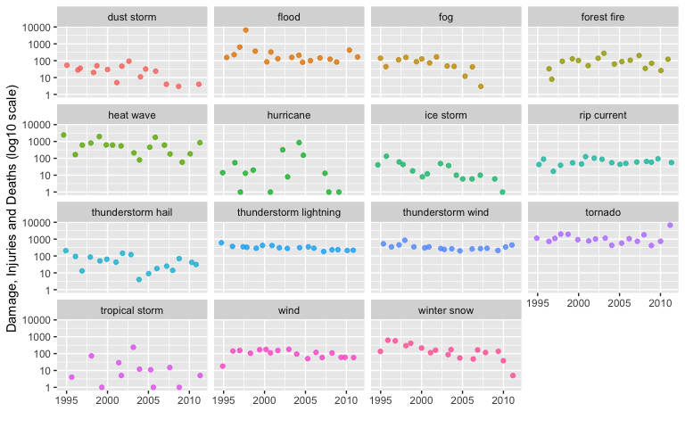

# Synopsis

Need to create the synopsis.

# US Storm data -- Analysis using R

#### Where does the data come from?
NCDC receives Storm Data from the National Weather Service. The National Weather service receive their information from a variety of sources, which include but are not limited to: county, state an federal emergency management officials, local law enforcement officials, skywarn spotters, NW damage surveys, newspaper clipping services, the insurance industry and the general public.

The purpose of this analysis is to assemble the analysis data, and report on key features observed.

# Data Processing

## Required R Packages, processing system details 

The `tidyverse` package will suit this analysis (dplyr and ggplot2 specifically).  This work was developed on the following system:

      Model Name: iMac
      Processor Name: Quad-Core Intel Core i7
      Memory: 32 GB


```r
library(tidyverse)
```

```
── Attaching packages ───────────────────────────────────────────────────────────────────────────────────── tidyverse 1.3.0 ──
```

```
✓ ggplot2 3.3.2     ✓ purrr   0.3.4
✓ tibble  3.0.3     ✓ dplyr   1.0.1
✓ tidyr   1.1.1     ✓ stringr 1.4.0
✓ readr   1.3.1     ✓ forcats 0.5.0
```

```
── Conflicts ──────────────────────────────────────────────────────────────────────────────────────── tidyverse_conflicts() ──
x dplyr::filter() masks stats::filter()
x dplyr::lag()    masks stats::lag()
```

```r
library(lubridate)
```

```

Attaching package: 'lubridate'
```

```
The following objects are masked from 'package:base':

    date, intersect, setdiff, union
```

#### File naming details.

```r
raw_link <- "https://d396qusza40orc.cloudfront.net/repdata%2Fdata%2FStormData.csv.bz2"
raw_zip_file_name <- "StormData.csv.bz2"
raw_file_name <- "StormData.csv"
```

#### Get the file if necessary.


```r
ifelse(file.exists(raw_zip_file_name) == FALSE,
       download.file(raw_link, raw_zip_file_name),
       "file exists...you are good to go")
```

```
[1] "file exists...you are good to go"
```

#### Make .csv available to examine raw data.

The data in the beginning looks simple, but further down in the raw file very large text items, including large blank space are observed.


```r
ifelse(file.exists(raw_file_name) == FALSE,
       bunzip2(raw_zip_file_name),
       "StormData.csv exists")
```

```
[1] "StormData.csv exists"
```


```r
raw_names <- read.csv(raw_file_name, header=TRUE, nrows = 1)
raw_us_storms <- read.csv(raw_file_name, stringsAsFactors = FALSE)
head(raw_us_storms)
```

```
  STATE__           BGN_DATE BGN_TIME TIME_ZONE COUNTY COUNTYNAME STATE  EVTYPE
1       1  4/18/1950 0:00:00     0130       CST     97     MOBILE    AL TORNADO
2       1  4/18/1950 0:00:00     0145       CST      3    BALDWIN    AL TORNADO
3       1  2/20/1951 0:00:00     1600       CST     57    FAYETTE    AL TORNADO
4       1   6/8/1951 0:00:00     0900       CST     89    MADISON    AL TORNADO
5       1 11/15/1951 0:00:00     1500       CST     43    CULLMAN    AL TORNADO
6       1 11/15/1951 0:00:00     2000       CST     77 LAUDERDALE    AL TORNADO
  BGN_RANGE BGN_AZI BGN_LOCATI END_DATE END_TIME COUNTY_END COUNTYENDN
1         0                                               0         NA
2         0                                               0         NA
3         0                                               0         NA
4         0                                               0         NA
5         0                                               0         NA
6         0                                               0         NA
  END_RANGE END_AZI END_LOCATI LENGTH WIDTH F MAG FATALITIES INJURIES PROPDMG
1         0                      14.0   100 3   0          0       15    25.0
2         0                       2.0   150 2   0          0        0     2.5
3         0                       0.1   123 2   0          0        2    25.0
4         0                       0.0   100 2   0          0        2     2.5
5         0                       0.0   150 2   0          0        2     2.5
6         0                       1.5   177 2   0          0        6     2.5
  PROPDMGEXP CROPDMG CROPDMGEXP WFO STATEOFFIC ZONENAMES LATITUDE LONGITUDE
1          K       0                                         3040      8812
2          K       0                                         3042      8755
3          K       0                                         3340      8742
4          K       0                                         3458      8626
5          K       0                                         3412      8642
6          K       0                                         3450      8748
  LATITUDE_E LONGITUDE_ REMARKS REFNUM
1       3051       8806              1
2          0          0              2
3          0          0              3
4          0          0              4
5          0          0              5
6          0          0              6
```

```r
str(raw_us_storms)
```

```
'data.frame':	902297 obs. of  37 variables:
 $ STATE__   : num  1 1 1 1 1 1 1 1 1 1 ...
 $ BGN_DATE  : chr  "4/18/1950 0:00:00" "4/18/1950 0:00:00" "2/20/1951 0:00:00" "6/8/1951 0:00:00" ...
 $ BGN_TIME  : chr  "0130" "0145" "1600" "0900" ...
 $ TIME_ZONE : chr  "CST" "CST" "CST" "CST" ...
 $ COUNTY    : num  97 3 57 89 43 77 9 123 125 57 ...
 $ COUNTYNAME: chr  "MOBILE" "BALDWIN" "FAYETTE" "MADISON" ...
 $ STATE     : chr  "AL" "AL" "AL" "AL" ...
 $ EVTYPE    : chr  "TORNADO" "TORNADO" "TORNADO" "TORNADO" ...
 $ BGN_RANGE : num  0 0 0 0 0 0 0 0 0 0 ...
 $ BGN_AZI   : chr  "" "" "" "" ...
 $ BGN_LOCATI: chr  "" "" "" "" ...
 $ END_DATE  : chr  "" "" "" "" ...
 $ END_TIME  : chr  "" "" "" "" ...
 $ COUNTY_END: num  0 0 0 0 0 0 0 0 0 0 ...
 $ COUNTYENDN: logi  NA NA NA NA NA NA ...
 $ END_RANGE : num  0 0 0 0 0 0 0 0 0 0 ...
 $ END_AZI   : chr  "" "" "" "" ...
 $ END_LOCATI: chr  "" "" "" "" ...
 $ LENGTH    : num  14 2 0.1 0 0 1.5 1.5 0 3.3 2.3 ...
 $ WIDTH     : num  100 150 123 100 150 177 33 33 100 100 ...
 $ F         : int  3 2 2 2 2 2 2 1 3 3 ...
 $ MAG       : num  0 0 0 0 0 0 0 0 0 0 ...
 $ FATALITIES: num  0 0 0 0 0 0 0 0 1 0 ...
 $ INJURIES  : num  15 0 2 2 2 6 1 0 14 0 ...
 $ PROPDMG   : num  25 2.5 25 2.5 2.5 2.5 2.5 2.5 25 25 ...
 $ PROPDMGEXP: chr  "K" "K" "K" "K" ...
 $ CROPDMG   : num  0 0 0 0 0 0 0 0 0 0 ...
 $ CROPDMGEXP: chr  "" "" "" "" ...
 $ WFO       : chr  "" "" "" "" ...
 $ STATEOFFIC: chr  "" "" "" "" ...
 $ ZONENAMES : chr  "" "" "" "" ...
 $ LATITUDE  : num  3040 3042 3340 3458 3412 ...
 $ LONGITUDE : num  8812 8755 8742 8626 8642 ...
 $ LATITUDE_E: num  3051 0 0 0 0 ...
 $ LONGITUDE_: num  8806 0 0 0 0 ...
 $ REMARKS   : chr  "" "" "" "" ...
 $ REFNUM    : num  1 2 3 4 5 6 7 8 9 10 ...
```

```r
names(raw_us_storms) <- tolower(names(raw_names))

nrow(raw_us_storms)
```

```
[1] 902297
```

```r
new_refnum <- as.data.frame(seq(1:nrow(raw_us_storms)))
names(new_refnum) <- "new_refnum"
head(new_refnum)
```

```
  new_refnum
1          1
2          2
3          3
4          4
5          5
6          6
```

```r
check_refnum <- raw_us_storms %>% select(refnum) %>% inner_join(new_refnum, by = c("refnum"="new_refnum"))
head(check_refnum)
```

```
  refnum
1      1
2      2
3      3
4      4
5      5
6      6
```

```r
nrow(raw_us_storms) == nrow(check_refnum)
```

```
[1] TRUE
```

#### take a sample to work with, it is easy to set to full data...


```r
set.seed(1234)
sample_refnum_list <- as.data.frame(sample(raw_us_storms$refnum, 1 * nrow(raw_us_storms)))
names(sample_refnum_list) <- "refnum"
head(sample_refnum_list)
```

```
  refnum
1 761680
2 630608
3 304108
4 295826
5 126055
6 382504
```

I chose to grab US "region" in case it is helpful in presentation...


```r
state_df <- data.frame(state.abb, state.region)
names(state_df) <- c("state", "region")
head(state_df)
```

```
  state region
1    AL  South
2    AK   West
3    AZ   West
4    AR  South
5    CA   West
6    CO   West
```

Main work...choose a year cutoff.


```r
yearx_cutoff <- 1995

sample_us_storms <- inner_join(raw_us_storms, sample_refnum_list, by = "refnum") %>%
	filter(propdmg > 0 | cropdmg > 0 | fatalities > 0 | injuries > 0) %>%
	left_join(state_df, by = "state") %>%
	mutate(bgn_datex=mdy_hms(bgn_date),
	       end_datex=mdy_hms(end_date),
	       yearx=year(bgn_datex),
	       monthx=month(bgn_datex),
	       storm_seconds=end_datex-bgn_datex,
	       storm_days=as.duration(storm_seconds)) %>% 
	filter(yearx >= yearx_cutoff) %>%
	select(refnum, region, state__:evtype, end_date, 
	       bgn_datex, end_datex, yearx, monthx, storm_seconds, storm_days,
	       fatalities, injuries,
	       propdmg, propdmgexp,
	       cropdmg, cropdmgexp) %>%
	mutate(evtype_original = evtype) %>%
	mutate(evtype=str_trim(tolower(evtype), side = "both")) %>%
	mutate(newpropdmg=ifelse(toupper(propdmgexp)=="K",
				 propdmg*1000,ifelse(toupper(propdmgexp)=="M",
				 		    propdmg*1000000, ifelse(toupper(propdmgexp)=="B",
				 		    			propdmg*1000000000,propdmg)))) %>%
	mutate(newcropdmg=ifelse(toupper(cropdmgexp)=="K",
				 cropdmg*1000,ifelse(toupper(cropdmgexp)=="M",
				 		    cropdmg*1000000, ifelse(toupper(cropdmgexp)=="B",
				 		    			cropdmg*1000000000,cropdmg)))) %>%
	mutate(economic_damage=newpropdmg+newcropdmg,
	       health_damage=fatalities+injuries)
head(sample_us_storms)
```

```
  refnum region state__           bgn_date bgn_time time_zone county
1 187566  South       1  10/4/1995 0:00:00     1200       CST      0
2 187568  South       1   8/3/1995 0:00:00     0900       CST      0
3 187569  South       1 11/11/1995 0:00:00     0500       CST      0
4 187570  South       1  10/3/1995 0:00:00     1200       CST      0
5 187571  South       1  10/4/1995 0:00:00     0000       CST      0
6 187574  South       1   3/7/1995 0:00:00     1751       CST      1
                                                    countyname state
1                                                   ALZ001>050    AL
2 ALZ051 - 052 - 053 - 055 - 056 - 059 - 061 - 062 - 063 - 064    AL
3                                   ALZ051 - 052 - 053 - 059 -    AL
4                                                   ALZ051>064    AL
5                                                   ALZ065>069    AL
6                                                      AUTAUGA    AL
                     evtype          end_date  bgn_datex  end_datex yearx
1 hurricane opal/high winds 10/5/1995 0:00:00 1995-10-04 1995-10-05  1995
2            hurricane erin                   1995-08-03       <NA>  1995
3        thunderstorm winds                   1995-11-11       <NA>  1995
4            hurricane opal 10/4/1995 0:00:00 1995-10-03 1995-10-04  1995
5            hurricane opal 10/5/1995 0:00:00 1995-10-04 1995-10-05  1995
6        thunderstorm winds                   1995-03-07       <NA>  1995
  monthx storm_seconds       storm_days fatalities injuries propdmg propdmgexp
1     10    86400 secs 86400s (~1 days)          2        0     0.1          B
2      8       NA secs             <NA>          0        0    25.0          M
3     11       NA secs             <NA>          0        0    50.0          K
4     10    86400 secs 86400s (~1 days)          0        0    48.0          M
5     10    86400 secs 86400s (~1 days)          0        0    20.0          m
6      3       NA secs             <NA>          0        0     2.0          K
  cropdmg cropdmgexp           evtype_original newpropdmg newcropdmg
1      10          M HURRICANE OPAL/HIGH WINDS    1.0e+08      1e+07
2       1          M            HURRICANE ERIN    2.5e+07      1e+06
3       0                   THUNDERSTORM WINDS    5.0e+04      0e+00
4       4          M            HURRICANE OPAL    4.8e+07      4e+06
5      10          m            HURRICANE OPAL    2.0e+07      1e+07
6       0                   THUNDERSTORM WINDS    2.0e+03      0e+00
  economic_damage health_damage
1         1.1e+08             2
2         2.6e+07             0
3         5.0e+04             0
4         5.2e+07             0
5         3.0e+07             0
6         2.0e+03             0
```

```r
count(sample_us_storms,yearx)
```

```
   yearx     n
1   1995 10457
2   1996 10040
3   1997 10322
4   1998 14013
5   1999 10609
6   2000 11508
7   2001 10298
8   2002 10432
9   2003 11015
10  2004 10484
11  2005 10014
12  2006 11974
13  2007 11953
14  2008 17633
15  2009 14434
16  2010 16019
17  2011 20570
```

figure out the maximum words involved in the event types...


```r
max_words_evtype <- raw_us_storms%>%
	filter(propdmg > 0 | cropdmg > 0 | fatalities > 0 | injuries > 0) %>% 
	mutate(word_count=lengths(strsplit(str_trim(tolower(evtype), side = "both"), split = " ")))%>%
	summarize(max_words=max(word_count))
max_words_evtype
```

```
  max_words
1         5
```

The following were coded after reviewing the individual words...we want to remove some words that are included, but offer no consistent distinction (e.g., "heavy rain" can simply be "rain").

We also take care to trim the values, some come to us in the data with leading and trailing blanks.


```r
word1x <-c("astronomical","black","drifting","dry",
"downburst","excessive","extreme","flash","gusty",
"hard","heavy","high","light","mixed",
"record","severe","southeast",
#"storm",
"strong","summary","torrential","urban","sml",
"wild","wintry")

word2x<-c("advisory","august","damage","emily","erin",
"high","mix","precip","roads","weather","weather/mix")

word3x<-c("and","28","precip")

word4x<-c("heavy")

words_to_remove <- c(word1x, word2x, word3x, word4x, "hvy")
```

The words to drop get applied here


```r
modified_evtype <- raw_us_storms %>%
	filter(propdmg > 0 | cropdmg > 0 | fatalities > 0 | injuries > 0) %>%
	select(evtype) %>%
	distinct(evtype) %>%
	mutate(evtype_original = evtype) %>%
	mutate(evtype = str_trim(tolower(evtype), side = "both")) %>%
	mutate(evtype = gsub("/", " ", evtype)) %>%
	mutate(evtype = gsub("-", " ", evtype)) %>%
	mutate(
		word1 = word(evtype, 1),
		word2 = word(evtype, 2),
		word3 = word(evtype, 3),
		word4 = word(evtype, 4),
		word5 = word(evtype, 5)) %>%
	mutate(
		word1 = ifelse(is.na(word1) == TRUE, "", str_trim(tolower(word1), side = "both")),
		word2 = ifelse(is.na(word2) == TRUE, "", str_trim(tolower(word2), side = "both")),
		word3 = ifelse(is.na(word3) == TRUE, "", str_trim(tolower(word3), side = "both")),
		word4 = ifelse(is.na(word4) == TRUE, "", str_trim(tolower(word4), side = "both")),
		word5 = ifelse(is.na(word5) == TRUE, "", str_trim(tolower(word5), side = "both"))) %>%
	mutate(word1 = ifelse(word1 %in% words_to_remove, "", word1)) %>%
	mutate(word2 = ifelse(word2 %in% words_to_remove, "", word2)) %>%
	mutate(word3 = ifelse(word3 %in% words_to_remove, "", word3)) %>%
	mutate(word4 = ifelse(word4 %in% words_to_remove, "", word4)) %>%
	mutate(word5 = ifelse(word5 %in% words_to_remove, "", word5)) %>%
	mutate(new_event_words = str_c(word1, word2, word3, word4, word5, sep = " ")) %>%
	mutate(new_event_words2 = gsub("    ", " ", new_event_words)) %>%
	mutate(new_event_words3 = gsub("   ", " ", new_event_words2)) %>%
	mutate(new_event_words4 = gsub("  ", " ", new_event_words3)) %>% 
	mutate(evtype_modified=str_trim(new_event_words4, side = "both")) %>%
	select(evtype_original, evtype_modified) %>%
	mutate(hail = grepl("hail", evtype_modified)) %>%
	mutate(fld = grepl("fld", evtype_modified)) %>%
	mutate(flood = grepl("flood", evtype_modified)) %>%
	mutate(wind = grepl("wind", evtype_modified)) %>%
	mutate(thu = grepl("thu", evtype_modified)) %>%
	mutate(tst = grepl("tst", evtype_modified)) %>%
	mutate(lightning = grepl("lightning", evtype_modified)) %>%
	mutate(ice = grepl("ice", evtype_modified)) %>%
	mutate(snow = grepl("snow", evtype_modified)) %>%
	mutate(hurri = grepl("hurri", evtype_modified)) %>%
	mutate(torn = grepl("torn", evtype_modified)) %>%
	mutate(winter_storm = grepl("winter storm", evtype_modified))
head(modified_evtype, 20)
```

```
                evtype_original              evtype_modified  hail   fld flood
1                       TORNADO                      tornado FALSE FALSE FALSE
2                     TSTM WIND                    tstm wind FALSE FALSE FALSE
3                          HAIL                         hail  TRUE FALSE FALSE
4         ICE STORM/FLASH FLOOD              ice storm flood FALSE FALSE  TRUE
5                  WINTER STORM                 winter storm FALSE FALSE FALSE
6     HURRICANE OPAL/HIGH WINDS         hurricane opal winds FALSE FALSE FALSE
7            THUNDERSTORM WINDS           thunderstorm winds FALSE FALSE FALSE
8                HURRICANE ERIN                    hurricane FALSE FALSE FALSE
9                HURRICANE OPAL               hurricane opal FALSE FALSE FALSE
10                   HEAVY RAIN                         rain FALSE FALSE FALSE
11                    LIGHTNING                    lightning FALSE FALSE FALSE
12            THUNDERSTORM WIND            thunderstorm wind FALSE FALSE FALSE
13                    DENSE FOG                    dense fog FALSE FALSE FALSE
14                  RIP CURRENT                  rip current FALSE FALSE FALSE
15            THUNDERSTORM WINS            thunderstorm wins FALSE FALSE FALSE
16               FLASH FLOODING                     flooding FALSE FALSE  TRUE
17                  FLASH FLOOD                        flood FALSE FALSE  TRUE
18                   TORNADO F0                   tornado f0 FALSE FALSE FALSE
19 THUNDERSTORM WINDS LIGHTNING thunderstorm winds lightning FALSE FALSE FALSE
20      THUNDERSTORM WINDS/HAIL      thunderstorm winds hail  TRUE FALSE FALSE
    wind   thu   tst lightning   ice  snow hurri  torn winter_storm
1  FALSE FALSE FALSE     FALSE FALSE FALSE FALSE  TRUE        FALSE
2   TRUE FALSE  TRUE     FALSE FALSE FALSE FALSE FALSE        FALSE
3  FALSE FALSE FALSE     FALSE FALSE FALSE FALSE FALSE        FALSE
4  FALSE FALSE FALSE     FALSE  TRUE FALSE FALSE FALSE        FALSE
5  FALSE FALSE FALSE     FALSE FALSE FALSE FALSE FALSE         TRUE
6   TRUE FALSE FALSE     FALSE FALSE FALSE  TRUE FALSE        FALSE
7   TRUE  TRUE FALSE     FALSE FALSE FALSE FALSE FALSE        FALSE
8  FALSE FALSE FALSE     FALSE FALSE FALSE  TRUE FALSE        FALSE
9  FALSE FALSE FALSE     FALSE FALSE FALSE  TRUE FALSE        FALSE
10 FALSE FALSE FALSE     FALSE FALSE FALSE FALSE FALSE        FALSE
11 FALSE FALSE FALSE      TRUE FALSE FALSE FALSE FALSE        FALSE
12  TRUE  TRUE FALSE     FALSE FALSE FALSE FALSE FALSE        FALSE
13 FALSE FALSE FALSE     FALSE FALSE FALSE FALSE FALSE        FALSE
14 FALSE FALSE FALSE     FALSE FALSE FALSE FALSE FALSE        FALSE
15 FALSE  TRUE FALSE     FALSE FALSE FALSE FALSE FALSE        FALSE
16 FALSE FALSE FALSE     FALSE FALSE FALSE FALSE FALSE        FALSE
17 FALSE FALSE FALSE     FALSE FALSE FALSE FALSE FALSE        FALSE
18 FALSE FALSE FALSE     FALSE FALSE FALSE FALSE  TRUE        FALSE
19  TRUE  TRUE FALSE      TRUE FALSE FALSE FALSE FALSE        FALSE
20  TRUE  TRUE FALSE     FALSE FALSE FALSE FALSE FALSE        FALSE
```

```r
count(modified_evtype, hurri)
```

```
  hurri   n
1 FALSE 478
2  TRUE  10
```
#yearx_cutoff <- 1995

Now we will finalize the analysis data frame.  We use the evtype_modified field to redefine the event types.  Note the evtype_original variable contains the original, unadulterated values (for research/confirmation).


```r
us_storms_final <- sample_us_storms %>% 
	# filter((economic_damage>0 | health_damage>0) & yearx >= yearx_cutoff) %>%
#	filter(economic_damage>0 & yearx >= yearx_cutoff) %>%
	left_join(modified_evtype, by = "evtype_original") %>% 
#	mutate(new_event_words4=str_trim(new_event_words4, side = "both")) %>%
	mutate(evtype_modified_final=ifelse(hurri==TRUE, "hurricane",
				       ifelse(fld==TRUE | flood==TRUE, "flood",
				              ifelse(hail==TRUE, "thunderstorm hail",
				              ifelse(lightning==TRUE, "thunderstorm lightning",
				              ifelse((thu==TRUE | tst==TRUE) & wind==FALSE & lightning==FALSE, "thunderstorm",
				                     ifelse((thu==TRUE | tst==TRUE) & wind==TRUE, "thunderstorm wind",
				                            ifelse((thu==TRUE | tst==TRUE) 
				                                   #& wind==FALSE 
				                                   & lightning==TRUE, "thunderstorm lightning",
				                            ifelse(evtype_modified %in% c("forest fire", "forest fires", "wildfire"), 
				                                   "forest fire",
				                            ifelse(evtype_modified %in% c("snow", "blizzard", "snow sleet freezing rain","winter","winter storm"), 
				                                   "winter snow",
				                            evtype_modified))))))))))
str(us_storms_final)
```

```
'data.frame':	211775 obs. of  42 variables:
 $ refnum               : num  187566 187568 187569 187570 187571 ...
 $ region               : Factor w/ 4 levels "Northeast","South",..: 2 2 2 2 2 2 2 2 2 2 ...
 $ state__              : num  1 1 1 1 1 1 1 1 1 1 ...
 $ bgn_date             : chr  "10/4/1995 0:00:00" "8/3/1995 0:00:00" "11/11/1995 0:00:00" "10/3/1995 0:00:00" ...
 $ bgn_time             : chr  "1200" "0900" "0500" "1200" ...
 $ time_zone            : chr  "CST" "CST" "CST" "CST" ...
 $ county               : num  0 0 0 0 0 1 1 1 1 3 ...
 $ countyname           : chr  "ALZ001>050" "ALZ051 - 052 - 053 - 055 - 056 - 059 - 061 - 062 - 063 - 064" "ALZ051 - 052 - 053 - 059 -" "ALZ051>064" ...
 $ state                : chr  "AL" "AL" "AL" "AL" ...
 $ evtype               : chr  "hurricane opal/high winds" "hurricane erin" "thunderstorm winds" "hurricane opal" ...
 $ end_date             : chr  "10/5/1995 0:00:00" "" "" "10/4/1995 0:00:00" ...
 $ bgn_datex            : POSIXct, format: "1995-10-04" "1995-08-03" ...
 $ end_datex            : POSIXct, format: "1995-10-05" NA ...
 $ yearx                : num  1995 1995 1995 1995 1995 ...
 $ monthx               : num  10 8 11 10 10 3 4 7 8 1 ...
 $ storm_seconds        : 'difftime' num  86400 NA NA 86400 ...
  ..- attr(*, "units")= chr "secs"
 $ storm_days           :Formal class 'Duration' [package "lubridate"] with 1 slot
  .. ..@ .Data: num  86400 NA NA 86400 86400 NA NA NA NA NA ...
 $ fatalities           : num  2 0 0 0 0 0 0 0 0 0 ...
 $ injuries             : num  0 0 0 0 0 0 0 0 0 0 ...
 $ propdmg              : num  0.1 25 50 48 20 2 35 5 3 5 ...
 $ propdmgexp           : chr  "B" "M" "K" "M" ...
 $ cropdmg              : num  10 1 0 4 10 0 0 0 0 0 ...
 $ cropdmgexp           : chr  "M" "M" "" "M" ...
 $ evtype_original      : chr  "HURRICANE OPAL/HIGH WINDS" "HURRICANE ERIN" "THUNDERSTORM WINDS" "HURRICANE OPAL" ...
 $ newpropdmg           : num  1.0e+08 2.5e+07 5.0e+04 4.8e+07 2.0e+07 2.0e+03 3.5e+04 5.0e+03 3.0e+03 5.0e+03 ...
 $ newcropdmg           : num  1e+07 1e+06 0e+00 4e+06 1e+07 0e+00 0e+00 0e+00 0e+00 0e+00 ...
 $ economic_damage      : num  1.1e+08 2.6e+07 5.0e+04 5.2e+07 3.0e+07 2.0e+03 3.5e+04 5.0e+03 3.0e+03 5.0e+03 ...
 $ health_damage        : num  2 0 0 0 0 0 0 0 0 0 ...
 $ evtype_modified      : chr  "hurricane opal winds" "hurricane" "thunderstorm winds" "hurricane opal" ...
 $ hail                 : logi  FALSE FALSE FALSE FALSE FALSE FALSE ...
 $ fld                  : logi  FALSE FALSE FALSE FALSE FALSE FALSE ...
 $ flood                : logi  FALSE FALSE FALSE FALSE FALSE FALSE ...
 $ wind                 : logi  TRUE FALSE TRUE FALSE FALSE TRUE ...
 $ thu                  : logi  FALSE FALSE TRUE FALSE FALSE TRUE ...
 $ tst                  : logi  FALSE FALSE FALSE FALSE FALSE FALSE ...
 $ lightning            : logi  FALSE FALSE FALSE FALSE FALSE FALSE ...
 $ ice                  : logi  FALSE FALSE FALSE FALSE FALSE FALSE ...
 $ snow                 : logi  FALSE FALSE FALSE FALSE FALSE FALSE ...
 $ hurri                : logi  TRUE TRUE FALSE TRUE TRUE FALSE ...
 $ torn                 : logi  FALSE FALSE FALSE FALSE FALSE FALSE ...
 $ winter_storm         : logi  FALSE FALSE FALSE FALSE FALSE FALSE ...
 $ evtype_modified_final: chr  "hurricane" "hurricane" "thunderstorm wind" "hurricane" ...
```

```r
us_storms_final%>%count(evtype, evtype_modified_final)
```

```
                            evtype  evtype_modified_final     n
1              agricultural freeze    agricultural freeze     3
2           astronomical high tide                   tide     8
3            astronomical low tide               low tide     2
4                        avalanche              avalanche   266
5                    beach erosion          beach erosion     1
6                        black ice                    ice     1
7                         blizzard            winter snow   230
8                     blowing dust           blowing dust     1
9                     blowing snow           blowing snow     2
10                breakup flooding                  flood     1
11                      brush fire             brush fire     1
12       coastal  flooding/erosion                  flood     1
13                 coastal erosion        coastal erosion     1
14                   coastal flood                  flood   156
15                coastal flooding                  flood    36
16        coastal flooding/erosion                  flood     3
17                   coastal storm          coastal storm     4
18                    coastalstorm           coastalstorm     1
19                            cold                   cold    28
20                   cold and snow              cold snow     1
21         cold and wet conditions    cold wet conditions     1
22                cold temperature       cold temperature     2
23                       cold wave              cold wave     1
24                    cold weather                   cold     4
25                 cold/wind chill        cold wind chill    90
26                       dam break              dam break     2
27                 damaging freeze        damaging freeze     6
28                       dense fog              dense fog    64
29                     dense smoke            dense smoke     1
30                       downburst                            1
31                         drought                drought   264
32          drought/excessive heat           drought heat    10
33                        drowning               drowning     1
34                  dry microburst             microburst    77
35                      dust devil             dust devil    90
36           dust devil waterspout  dust devil waterspout     1
37                      dust storm             dust storm    98
38                     early frost            early frost     1
39              erosion/cstl flood                  flood     2
40                  excessive heat                   heat   698
41              excessive rainfall               rainfall     1
42                  excessive snow            winter snow    25
43               excessive wetness                wetness     1
44                   extended cold          extended cold     1
45                    extreme cold                   cold   179
46         extreme cold/wind chill        cold wind chill   111
47                    extreme heat                   heat    14
48              extreme wind chill             wind chill     1
49               extreme windchill              windchill    19
50                falling snow/ice       falling snow ice     2
51                     flash flood                  flood 19851
52        flash flood - heavy rain                  flood     2
53               flash flood winds                  flood     1
54             flash flood/ street                  flood     1
55               flash flood/flood                  flood     3
56                  flash flooding                  flood   100
57                    flash floods                  flood     8
58                           flood                  flood  9712
59              flood & heavy rain                  flood     2
60                     flood/flash                  flood     1
61               flood/flash flood                  flood    88
62               flood/flash/flood                  flood     1
63                flood/rain/winds                  flood     5
64                        flooding                  flood    23
65             flooding/heavy rain                  flood     1
66                          floods                  flood     1
67                             fog                    fog   104
68                          freeze                 freeze    16
69                freezing drizzle       freezing drizzle     7
70                    freezing fog           freezing fog     7
71                   freezing rain          freezing rain    18
72              freezing rain/snow     freezing rain snow     3
73                  freezing spray         freezing spray     1
74                           frost                  frost     2
75                    frost/freeze           frost freeze   117
76                    funnel cloud           funnel cloud     9
77                           glaze                  glaze    20
78                       glaze ice              glaze ice     2
79                   gradient wind          gradient wind     6
80                     grass fires            grass fires     1
81                        gustnado               gustnado     2
82                      gusty wind                   wind    13
83                 gusty wind/hail      thunderstorm hail     1
84             gusty wind/hvy rain              wind rain     1
85                 gusty wind/rain              wind rain     1
86                     gusty winds                  winds    30
87                            hail      thunderstorm hail 23860
88                       hail 0.75      thunderstorm hail     1
89                        hail 075      thunderstorm hail     1
90                        hail 100      thunderstorm hail     1
91                        hail 125      thunderstorm hail     1
92                        hail 150      thunderstorm hail     1
93                        hail 175      thunderstorm hail     2
94                        hail 200      thunderstorm hail     1
95                        hail 275      thunderstorm hail     3
96                        hail 450      thunderstorm hail     1
97                         hail 75      thunderstorm hail     1
98                     hail damage      thunderstorm hail     1
99                       hailstorm      thunderstorm hail     3
100                    hard freeze                 freeze     2
101                 hazardous surf         hazardous surf     1
102                           heat                   heat   203
103                      heat wave              heat wave    33
104              heat wave drought      heat wave drought     1
105                      heavy mix                            2
106                     heavy rain                   rain  1080
107           heavy rain and flood                  flood     1
108           heavy rain/high surf              rain surf     1
109      heavy rain/severe weather                   rain     1
110                    heavy rains                  rains     4
111                     heavy seas                   seas     2
112                     heavy snow            winter snow  1134
113      heavy snow and high winds             snow winds     1
114    heavy snow and strong winds             snow winds     1
115              heavy snow shower            snow shower     1
116             heavy snow squalls           snow squalls    12
117             heavy snow-squalls           snow squalls    15
118  heavy snow/high winds & flood           snow winds &     1
119                 heavy snow/ice               snow ice     1
120                     heavy surf                   surf    30
121            heavy surf and wind              surf wind     1
122    heavy surf coastal flooding                  flood     1
123           heavy surf/high surf              surf surf    50
124                   heavy swells                 swells     1
125                    high  winds                  winds     1
126                      high seas                   seas     6
127                      high surf                   surf   132
128             high surf advisory                   surf     1
129                    high swells                 swells     2
130                     high water                  water     2
131                     high waves                  waves     1
132                      high wind                   wind  5416
133                high wind (g40)             wind (g40)     2
134               high wind damage                   wind     2
135                     high winds                  winds   311
136         high winds heavy rains            winds rains     1
137                      hurricane              hurricane   126
138              hurricane edouard              hurricane     1
139                 hurricane erin              hurricane     7
140                hurricane felix              hurricane     1
141                 hurricane opal              hurricane     8
142      hurricane opal/high winds              hurricane     1
143     hurricane-generated swells              hurricane     3
144              hurricane/typhoon              hurricane    72
145                       hvy rain                   rain     1
146          hyperthermia/exposure  hyperthermia exposure     1
147           hypothermia/exposure   hypothermia exposure     6
148                            ice                    ice     2
149           ice jam flood (minor                  flood     1
150               ice jam flooding                  flood     2
151                    ice on road            ice on road     1
152                      ice roads                    ice     1
153                      ice storm              ice storm   653
154               ice/strong winds              ice winds     1
155                      icy roads                    icy    22
156               lake effect snow       lake effect snow     4
157                     lake flood                  flood     1
158               lake-effect snow       lake effect snow   194
159                lakeshore flood                  flood     5
160                      landslide              landslide   193
161                     landslides             landslides     1
162                      landslump              landslump     1
163                      landspout              landspout     2
164               late season snow       late season snow     1
165            light freezing rain          freezing rain    22
166                     light snow            winter snow   141
167                 light snowfall               snowfall     1
168                      lightning thunderstorm lightning 12026
169             lightning  wauseon thunderstorm lightning     1
170       lightning and heavy rain thunderstorm lightning     1
171 lightning and thunderstorm win thunderstorm lightning     1
172                 lightning fire thunderstorm lightning     1
173               lightning injury thunderstorm lightning     1
174   lightning thunderstorm winds thunderstorm lightning     1
175                     lightning. thunderstorm lightning     1
176                      ligntning              ligntning     1
177                marine accident        marine accident     1
178                    marine hail      thunderstorm hail     2
179               marine high wind            marine wind    19
180                  marine mishap          marine mishap     2
181             marine strong wind            marine wind    46
182       marine thunderstorm wind      thunderstorm wind    33
183               marine tstm wind      thunderstorm wind   109
184                     microburst             microburst     1
185                   mixed precip                            6
186            mixed precipitation          precipitation    18
187                      mud slide              mud slide     2
188      mud slides urban flooding                  flood     1
189                       mudslide               mudslide     5
190                      mudslides              mudslides     1
191                  non tstm wind      thunderstorm wind     1
192         non-severe wind damage               non wind     1
193                  non-tstm wind      thunderstorm wind     1
194                          other                  other    34
195                           rain                   rain     3
196                      rain/snow              rain snow     2
197           rapidly rising water   rapidly rising water     1
198                    record cold                   cold     1
199                    record heat                   heat     1
200                    rip current            rip current   389
201                   rip currents           rip currents   241
202        rip currents/heavy surf      rip currents surf     2
203         river and stream flood                  flood     2
204                    river flood                  flood    95
205                 river flooding                  flood    14
206                     rock slide             rock slide     1
207                     rogue wave             rogue wave     1
208                     rough seas             rough seas     3
209                     rough surf             rough surf     2
210                    rural flood                  flood     1
211                         seiche                 seiche     9
212            severe thunderstorm           thunderstorm     5
213      severe thunderstorm winds      thunderstorm wind     3
214           severe thunderstorms           thunderstorm     2
215                          sleet                  sleet     1
216                     small hail      thunderstorm hail    11
217                           snow            winter snow    31
218                   snow and ice               snow ice     3
219             snow freezing rain     snow freezing rain    10
220                    snow squall            snow squall     3
221                   snow squalls           snow squalls    10
222                       snow/ice               snow ice     1
223       snow/sleet/freezing rain            winter snow     2
224              storm force winds      storm force winds     1
225                    storm surge            storm surge   169
226               storm surge/tide       storm surge tide    47
227                    strong wind                   wind  3370
228                   strong winds                  winds    48
229            thundeerstorm winds      thunderstorm wind     1
230            thunderestorm winds      thunderstorm wind     1
231                    thundersnow           thunderstorm     1
232                   thunderstorm           thunderstorm    14
233            thunderstorm  winds      thunderstorm wind     2
234         thunderstorm damage to           thunderstorm     1
235              thunderstorm wind      thunderstorm wind 43170
236        thunderstorm wind (g40)      thunderstorm wind     1
237       thunderstorm wind 60 mph      thunderstorm wind     2
238       thunderstorm wind 65 mph      thunderstorm wind     1
239        thunderstorm wind 65mph      thunderstorm wind     1
240       thunderstorm wind 98 mph      thunderstorm wind     1
241          thunderstorm wind g52      thunderstorm wind     1
242          thunderstorm wind g55      thunderstorm wind     1
243          thunderstorm wind g60      thunderstorm wind     1
244        thunderstorm wind trees      thunderstorm wind     1
245             thunderstorm wind.      thunderstorm wind     1
246        thunderstorm wind/ tree      thunderstorm wind     1
247       thunderstorm wind/ trees      thunderstorm wind     4
248       thunderstorm wind/awning      thunderstorm wind     1
249    thunderstorm wind/lightning thunderstorm lightning     1
250             thunderstorm winds      thunderstorm wind  5096
251      thunderstorm winds 63 mph      thunderstorm wind     1
252         thunderstorm winds and      thunderstorm wind     1
253         thunderstorm winds g60      thunderstorm wind     1
254        thunderstorm winds hail      thunderstorm hail    40
255   thunderstorm winds lightning thunderstorm lightning     6
256      thunderstorm winds/ flood                  flood     2
257        thunderstorm winds/hail      thunderstorm hail     3
258           thunderstorm winds53      thunderstorm wind     1
259         thunderstorm windshail      thunderstorm hail     1
260            thunderstorm windss      thunderstorm wind     6
261              thunderstorm wins           thunderstorm     1
262             thunderstorms wind      thunderstorm wind     1
263            thunderstorms winds      thunderstorm wind     4
264                  thunderstormw           thunderstorm     1
265              thundertorm winds      thunderstorm wind     3
266              thunerstorm winds      thunderstorm wind     1
267                 tidal flooding                  flood     4
268                        tornado                tornado 13000
269                     tornado f0             tornado f0     5
270                     tornado f1             tornado f1     4
271                     tornado f2             tornado f2     2
272                     tornado f3             tornado f3     2
273            torrential rainfall               rainfall     1
274            tropical depression    tropical depression    35
275                 tropical storm         tropical storm   412
276            tropical storm dean    tropical storm dean     1
277           tropical storm jerry   tropical storm jerry     2
278                      tstm wind      thunderstorm wind 61903
279               tstm wind  (g45)      thunderstorm wind     1
280                 tstm wind (41)      thunderstorm wind     1
281                tstm wind (g35)      thunderstorm wind     1
282                tstm wind (g40)      thunderstorm wind     9
283                tstm wind (g45)      thunderstorm wind    37
284                   tstm wind 40      thunderstorm wind     1
285                   tstm wind 45      thunderstorm wind     1
286                   tstm wind 55      thunderstorm wind     2
287                  tstm wind 65)      thunderstorm wind     1
288        tstm wind and lightning thunderstorm lightning     1
289               tstm wind damage      thunderstorm wind     1
290                  tstm wind g45      thunderstorm wind     1
291                  tstm wind g58      thunderstorm wind     1
292                 tstm wind/hail      thunderstorm hail   441
293                     tstm winds      thunderstorm wind     5
294                        tsunami                tsunami    14
295               tunderstorm wind       tunderstorm wind     1
296                        typhoon                typhoon     9
297              unseasonable cold      unseasonable cold     1
298              unseasonably cold      unseasonably cold     4
299              unseasonably warm      unseasonably warm     7
300      unseasonably warm and dry      unseasonably warm     1
301                unseasonal rain        unseasonal rain     2
302 urban and small stream floodin                  flood     1
303                    urban flood                  flood    62
304                 urban flooding                  flood    21
305       urban/small stream flood                  flood     6
306           urban/sml stream fld                  flood   702
307                   volcanic ash           volcanic ash     2
308                   warm weather                   warm     1
309                     waterspout             waterspout    30
310             waterspout tornado     waterspout tornado     1
311             waterspout-tornado     waterspout tornado     1
312            waterspout/ tornado     waterspout tornado     1
313             waterspout/tornado     waterspout tornado     2
314                 wet microburst         wet microburst     3
315                      whirlwind              whirlwind     3
316                     wild fires                  fires     2
317               wild/forest fire            forest fire   383
318              wild/forest fires            forest fire     1
319                       wildfire            forest fire   853
320                           wind                   wind    73
321                  wind and wave              wind wave     1
322                    wind damage                   wind     8
323                     wind storm             wind storm     1
324                          winds                  winds     6
325                   winter storm            winter snow  1479
326        winter storm high winds     winter storm winds     1
327                 winter weather            winter snow   407
328             winter weather mix            winter snow     2
329             winter weather/mix            winter snow   139
330                     wintry mix                            4
```

We will now determine how many items (event types) are worthy of display.  For example, to choose the "top 10 economic" events by assigning 10 to top_n_filter_e variable.  Assign the desired amount of top health data in a similar fashion.

Further below we will see what this gives us in terms of "complete picture".


```r
top_n_filter_e <- 10
top_n_filter_e <- 15
top_n_filter_h <- 15

top_harmful_economic_evtypes <- filter(us_storms_final, economic_damage>0) %>%
	group_by(evtype_modified_final)%>%
	summarize(economic_damage2=sum(economic_damage), 
		  mean_economic_damage2=mean(economic_damage), 
		  neconomic_damage2=n()) %>% 
	arrange(desc(economic_damage2))
```

```
`summarise()` ungrouping output (override with `.groups` argument)
```

```r
#	arrange(desc(mean_economic_damage2))

#top_n_harmful_economic_events <- top_harmful_economic_evtypes[1:top_n_filter,"evtype_modified_final"]
top_n_harmful_economic_events <- top_harmful_economic_evtypes[1:top_n_filter_e,"evtype_modified_final"]
top_n_harmful_economic_events
```

```
# A tibble: 15 x 1
   evtype_modified_final
   <chr>                
 1 flood                
 2 hurricane            
 3 storm surge          
 4 tornado              
 5 thunderstorm hail    
 6 drought              
 7 thunderstorm wind    
 8 tropical storm       
 9 forest fire          
10 wind                 
11 storm surge tide     
12 rain                 
13 ice storm            
14 winter snow          
15 cold                 
```

```r
top_harmful_health_evtypes <- filter(us_storms_final, health_damage>0) %>%
	group_by(evtype_modified_final)%>%
	summarize(health_damage2=sum(health_damage), 
		  mean_health_damage2=mean(health_damage), 
		  nhealth_damage2=n()) %>% 
	arrange(desc(health_damage2))
```

```
`summarise()` ungrouping output (override with `.groups` argument)
```

```r
#	arrange(desc(mean_health_damage2))
sum(top_harmful_health_evtypes$health_damage2)
```

```
[1] 72678
```

```r
top_n_harmful_health_events <- top_harmful_health_evtypes[1:top_n_filter_h,c("evtype_modified_final","health_damage2")]
#top_n_harmful_health_events <- top_harmful_health_evtypes[1:15,"evtype_modified_final"]
top_n_harmful_health_events
```

```
# A tibble: 15 x 2
   evtype_modified_final  health_damage2
   <chr>                           <dbl>
 1 tornado                         23310
 2 heat                            11630
 3 flood                           10012
 4 thunderstorm wind                5986
 5 thunderstorm lightning           5363
 6 winter snow                      3441
 7 wind                             1821
 8 forest fire                      1543
 9 hurricane                        1462
10 thunderstorm hail                1036
11 fog                               779
12 rip current                       587
13 heat wave                         539
14 rip currents                      501
15 dust storm                        441
```

Here we will reduce our data to items of interest (selected top ## event types)...


```r
economic <- filter(us_storms_final, economic_damage>0) %>%
#	filter(yearx>=1995)%>% 
	inner_join(top_n_harmful_economic_events, by = "evtype_modified_final") %>%
#	group_by(yearx, region, evtype_modified_final)%>%
	group_by(yearx, evtype_modified_final)%>%
#	group_by(new_event_words5)%>%
	summarize(economic_damage2=sum(economic_damage), 
		  mean_economic_damage2=mean(economic_damage), 
		  neconomic_damage2=n(),
		  xxxlog=log10(economic_damage2)) %>% 
	arrange(desc(economic_damage2))
```

```
`summarise()` regrouping output by 'yearx' (override with `.groups` argument)
```

```r
#	arrange(desc(mean_economic_damage2))
print(economic,n=10)
```

```
# A tibble: 227 x 6
# Groups:   yearx [17]
   yearx evtype_modified… economic_damage2 mean_economic_d… neconomic_damag…
   <dbl> <chr>                       <dbl>            <dbl>            <int>
 1  2006 flood                118824712570        89814598.             1323
 2  2005 hurricane             51799317000      1569676273.               33
 3  2005 storm surge           43058565000      1345580156.               32
 4  2004 hurricane             18922255800       675794850                28
 5  2011 tornado                9850961700         6789085.             1451
 6  2011 flood                  9379815150         3387438.             2769
 7  1997 flood                  7028552000         4963667.             1416
 8  1999 hurricane              5541066000       167911091.               33
 9  2010 flood                  5196113440         1763786.             2946
10  2001 tropical storm         5188110000       370579286.               14
# … with 217 more rows, and 1 more variable: xxxlog <dbl>
```

```r
nrow(filter(us_storms_final, health_damage>0))
```

```
[1] 13717
```

```r
health <- filter(us_storms_final, health_damage>0) %>%
#	filter(yearx>=1995)%>% 
	inner_join(top_n_harmful_health_events, by = "evtype_modified_final") %>%
#	group_by(yearx, region, evtype_modified_final)%>%
	group_by(yearx, evtype_modified_final)%>%
#	group_by(new_event_words5)%>%
	summarize(health_damage2=sum(health_damage), 
		  mean_health_damage2=mean(health_damage), 
		  nhealth_damage2=n(),
		  xxxlog=log10(health_damage2)) %>% ungroup %>%
	arrange(desc(health_damage2))
```

```
`summarise()` regrouping output by 'yearx' (override with `.groups` argument)
```

```r
#	arrange(desc(mean_health_damage2))
nrow(health)
```

```
[1] 211
```

```r
print(health,n=top_n_filter_h)
```

```
# A tibble: 211 x 6
   yearx evtype_modified… health_damage2 mean_health_dam… nhealth_damage2 xxxlog
   <dbl> <chr>                     <dbl>            <dbl>           <int>  <dbl>
 1  2011 tornado                    6750            28.0              241   3.83
 2  1998 flood                      6581            51.0              129   3.82
 3  1998 tornado                    2004            11.5              174   3.30
 4  1995 heat                       1981            31.4               63   3.30
 5  1999 heat                       1963            20.2               97   3.29
 6  1999 tornado                    1936            13.6              142   3.29
 7  2008 tornado                    1819            10.6              172   3.26
 8  2006 heat                       1765            27.2               65   3.25
 9  2003 tornado                    1141            10.8              106   3.06
10  1995 tornado                    1132             9.76             116   3.05
11  1997 tornado                    1101             9.41             117   3.04
12  2006 tornado                    1059             8.34             127   3.02
13  2002 tornado                    1023            10.2              100   3.01
14  2000 tornado                     923            10.4               89   2.97
15  2004 hurricane                   862            95.8                9   2.94
# … with 196 more rows
```

Finally, we calculate the total of selected data and divide by the total of all data (obviously per economic/health topic).  We confirm here we cover over 90% of the data using the above settings...


```r
sum(economic$economic_damage2)/sum(sample_us_storms$economic_damage)
```

```
[1] 0.9838945
```

```r
sum(health$health_damage2)/sum(sample_us_storms$health_damage)
```

```
[1] 0.9418393
```

```r
# sum(sample_us_storms$injuries)
# sum(sample_us_storms$fatalities)
# sum(raw_us_storms$injuries)
# sum(raw_us_storms$fatalities)

#filter(sample_us_storms, health_damage>0 & yearx>=yearx)%>%summarize(sumx=sum(injuries))
```

# Results

Now for some plots...


```r
options(scipen = 5)

ggplot(economic) +
	geom_col(mapping = aes(x=yearx, 
#			      y=xxxlog, 
			      y=economic_damage2, 
			      fill=evtype_modified_final), alpha=.7) + 
	scale_y_log10() +
	facet_wrap("evtype_modified_final")
```

<!-- -->


```r
ggplot(health) +
	geom_col(mapping = aes(x=yearx, 
#			      y=xxxlog, 
			      y=health_damage2, 
			      fill=evtype_modified_final), alpha=.7) + 
	scale_y_log10() +
	facet_wrap("evtype_modified_final")
```

<!-- -->
